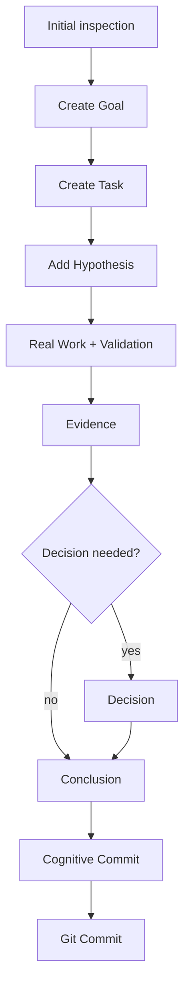

# CTX Goal Flow Diagram
If a language model and its agent lose context, this is the tool you need.

This document shows a concrete flow for resolving a goal in CTX and how each command builds the cognitive map inside `.ctx`.

## Example: close a viewer gap with evidence

Goal: `Make a viewer gap visible and close it with evidence`.

### Stage 0: inspect current state

```powershell
ctx status
ctx graph summary
ctx log
ctx audit
ctx next
```

What this produces in `.ctx`:

- nothing mutates yet
- confirms branch, head, and consistency

### Stage 1: create the goal and primary task

```powershell
ctx goal add --title "Improve viewer clarity"
ctx task add --title "Add task-state filter to the graph" --goal <goalId>
```

What this produces in `.ctx`:

- `goals/*.json` with the goal
- `tasks/*.json` with the task and linked `goalId`
- the graph starts connecting the goal to the task

### Stage 2: justify the work with a hypothesis

```powershell
ctx hypo add --statement "Filtering tasks by state reduces graph noise" --task <taskId>
```

What this produces in `.ctx`:

- `hypotheses/*.json` linked to the task
- the cognitive line now has an explicit rationale

### Stage 3: execute real work

```powershell
dotnet build Ctx.Viewer/Ctx.Viewer.csproj
dotnet test .\Ctx.Tests\Ctx.Tests.csproj -m:1
```

What this produces in `.ctx`:

- no new cognitive nodes yet
- technical validation is now available to record as evidence

### Stage 4: record evidence

```powershell
ctx evidence add --title "Graph exposes task-state filter" --summary "The graph can now hide Done work and isolate active work." --source "Ctx.Viewer/wwwroot/app.js" --kind Experiment --supports hypothesis:<hypothesisId>
```

What this produces in `.ctx`:

- `evidence/*.json` linked to the hypothesis
- the graph now connects evidence to the hypothesis

### Stage 5: record a decision when direction is fixed

```powershell
ctx decision add --title "Use task-state filters as the main graph control" --rationale "It keeps active work readable without hiding full history." --state Accepted --hypotheses <hypothesisId> --evidence <evidenceId>
```

What this produces in `.ctx`:

- `decisions/*.json` with rationale and links to hypothesis and evidence
- the graph adds decision as a first-class node

### Stage 6: close with a conclusion

```powershell
ctx conclusion add --summary "The viewer now filters tasks by state and reduces graph noise." --state Accepted --evidence <evidenceId> --decisions <decisionId> --tasks <taskId>
```

What this produces in `.ctx`:

- `conclusions/*.json` connecting task, decision, and evidence
- the cognitive line is closed

### Stage 7: cognitive commit and Git commit

```powershell
ctx commit -m "Add task-state filter to viewer graph"
git add ...
git commit -m "Add task-state filter to viewer graph"
git push origin main
```

What this produces in `.ctx`:

- `commits/*.json` with snapshot and cognitive diff
- Git stores the code change in parallel

## Flow diagram



## Resulting cognitive path

```text
Goal -> Task -> Hypothesis -> Evidence -> Decision -> Conclusion -> Commit
```

If there is no explicit decision, the line can move directly from `Evidence` to `Conclusion`.

## Operating notes

- do not edit `.ctx` manually unless there is no other viable path
- use `ctx audit` when you suspect cognitive debt
- record operational failures as `evidence`, even if they seem small
