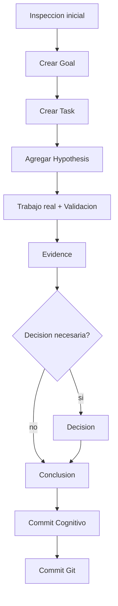

# Diagrama de Flujo de un Objetivo en CTX
Si un modelo de lenguaje y su agente pierden el contexto, esta es la herramienta que necesitas.

Este documento muestra un flujo claro de como se resuelve un objetivo en CTX,
con un ejemplo concreto de comandos y como esos comandos construyen el mapa
cognitivo dentro de `.ctx`.

## Ejemplo real: objetivo con etapas y comandos

Objetivo: `Hacer visible un gap del viewer y cerrarlo con evidencia`.

### Etapa 0: iniciar y revisar contexto

```powershell
ctx status
ctx graph summary
ctx log
ctx audit
ctx next
```

Que produce en `.ctx`:
- No muta nada, solo lee el estado actual.
- Confirma head, branch y consistencia.

### Etapa 1: crear el objetivo y la tarea principal

```powershell
ctx goal add --title "Mejorar claridad del viewer"
ctx task add --title "Agregar filtro por estado de tasks en el grafo" --goal <goalId>
```

Que produce en `.ctx`:
- `goals/*.json` con el objetivo.
- `tasks/*.json` con la tarea y el `goalId` relacionado.
- El grafo empieza a conectar el objetivo con la tarea.

### Etapa 2: justificar con hypothesis

```powershell
ctx hypo add --statement "Filtrar tasks por estado reduce ruido en el grafo" --task <taskId>
```

Que produce en `.ctx`:
- `hypotheses/*.json` asociado a la task.
- La linea cognitiva ya tiene una explicacion.

### Etapa 3: ejecutar trabajo real (codigo o docs)

Ejemplo: cambios en el viewer.

```powershell
# editar UI, luego validar
dotnet build Ctx.Viewer/Ctx.Viewer.csproj
dotnet test .\Ctx.Tests\Ctx.Tests.csproj -m:1
```

Que produce en `.ctx`:
- Todavia no agrega nodos cognitivos, pero deja evidencia tecnica disponible para registrar.

### Etapa 4: registrar evidencia

```powershell
ctx evidence add --title "Filtro de estado visible en el grafo" --summary "El grafo ahora permite ocultar Done y ver solo trabajo activo." --source "Ctx.Viewer/wwwroot/app.js" --kind Experiment --supports hypothesis:<hypothesisId>
```

Que produce en `.ctx`:
- `evidence/*.json` vinculado a la hypothesis.
- El grafo ahora conecta evidence -> hypothesis.

### Etapa 5: registrar decision (si se fija una direccion)

```powershell
ctx decision add --title "Usar filtros por estado como control principal del grafo" --rationale "Hace legible el trabajo activo sin ocultar historia completa." --state Accepted --hypotheses <hypothesisId> --evidence <evidenceId>
```

Que produce en `.ctx`:
- `decisions/*.json` con rationale y links a hypothesis/evidence.
- El grafo agrega decision como nodo principal.

### Etapa 6: cerrar conclusion

```powershell
ctx conclusion add --summary "El viewer ahora permite filtrar tareas por estado y reduce ruido." --state Accepted --evidence <evidenceId> --decisions <decisionId> --tasks <taskId>
```

Que produce en `.ctx`:
- `conclusions/*.json` conectando tarea, decision y evidence.
- La linea cognitiva queda cerrada.

### Etapa 7: commit cognitivo y commit Git

```powershell
ctx commit -m "Add task-state filter to viewer graph"
git add ...
git commit -m "Add task-state filter to viewer graph"
git push origin main
```

Que produce en `.ctx`:
- `commits/*.json` con snapshot y diff cognitivo.
- En Git, el codigo queda versionado en paralelo.

## Diagrama de flujo (Mermaid)



## Mapa cognitivo resultante

La ruta principal queda asi:

```
Goal -> Task -> Hypothesis -> Evidence -> Decision -> Conclusion -> Commit
```

Si no hay decision explicita, la linea salta de Evidence a Conclusion.

## Variante A: sub-goals tematicos para ordenar lineas

Cuando un goal general acumula demasiadas tasks, el grafo pierde contraste.
La variante A introduce sub-goals tematicos (sin cambiar el modelo), para
mantener legible el hilo cognitivo por dominio.

### Criterio practico

- Usar sub-goals si el goal principal ya mezcla temas distintos.
- Usar sub-goals si mas de 10-15 commits recientes referencian al mismo goal.
- Mantener el goal principal estable y ubicar el trabajo concreto en sub-goals.

### Ejemplo aplicado (viewer)

Goal principal: `Visualize timeline`

Sub-goals propuestos:

- `Viewer commit focus UX`
- `Viewer history UX`
- `Viewer graph filters`
- `Viewer runtime reliability`

#### Flujo con sub-goal

```powershell
ctx line open --goal <goalId> --title "Viewer commit focus UX" --task-title "Focus commit graph on cognitive path"
ctx hypo add --statement "Path-only focus makes commit review faster" --task <taskId>
ctx evidence add --title "Commit focus shows only path" --summary "Graph now renders just the commit path when Focus is on." --source "Ctx.Viewer/wwwroot/app.js" --kind Observation --supports hypothesis:<hypothesisId>
ctx conclusion add --summary "Commit focus now filters to the selected path." --state Accepted --evidence <evidenceId> --goals <subGoalId> --tasks <taskId>
ctx commit -m "Focus commit graph on cognitive path"
```

### Mapa cognitivo resultante

```
Goal (Visualize timeline)
  -> Sub-goal (Viewer commit focus UX)
     -> Task -> Hypothesis -> Evidence -> Conclusion -> Commit
```

### Ventajas

- Reduce el ruido del goal general.
- Hace visibles las lineas de pensamiento por tema.
- Permite decidir en que area trabajar sin perder el contexto global.

### Riesgos si no se disciplina

- Crear sub-goals sin criterio y duplicar temas.
- Perder consistencia si tareas similares se van a sub-goals distintos.

Regla simple: si el trabajo comparte tema y audiencia, pertenece al mismo sub-goal.

### Regla de ruteo para tareas nuevas

- Todas las tareas nuevas del viewer deben apuntar a un sub-goal tematico.
- No mover retroactivamente tareas cerradas salvo que exista un motivo operativo fuerte.
- Si una tarea afecta mas de un sub-goal, crear una tarea principal y registrar dependencias como tasks separadas.

Esto mantiene la trazabilidad historica intacta y evita reescribir commits pasados.

## Notas operativas

- No editar `.ctx` manualmente salvo ultimo recurso.
- Usar `ctx audit` cuando haya sospecha de deuda cognitiva.
- Registrar fallas operativas como `evidence`, incluso si son pequenas.

