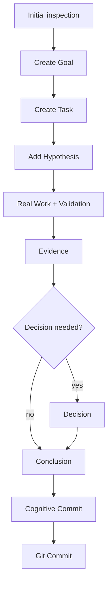

# CTX 目标流转图
如果语言模型和它的代理会丢失上下文，这就是你需要的工具。

本文展示了在 CTX 中解决一个目标的具体流程，以及每个命令如何在 `.ctx` 内构建认知地图。

## 示例：用证据关闭一个 viewer 缺口

目标：`Make a viewer gap visible and close it with evidence`。

### 阶段 0：检查当前状态

```powershell
ctx status
ctx graph summary
ctx log
ctx audit
ctx next
```

这会在 `.ctx` 中产生：

- 此时还没有任何变更
- 仅用于确认 branch、head 和一致性

### 阶段 1：创建目标和主任务

```powershell
ctx goal add --title "Improve viewer clarity"
ctx task add --title "Add task-state filter to the graph" --goal <goalId>
```

这会在 `.ctx` 中产生：

- `goals/*.json` 中新增 goal
- `tasks/*.json` 中新增 task，并带有对应的 `goalId`
- 图开始将 goal 与 task 连接起来

### 阶段 2：用 hypothesis 说明这项工作的理由

```powershell
ctx hypo add --statement "Filtering tasks by state reduces graph noise" --task <taskId>
```

这会在 `.ctx` 中产生：

- 与 task 关联的 `hypotheses/*.json`
- 这条认知线路现在有了显式理由

### 阶段 3：执行真实工作

```powershell
dotnet build Ctx.Viewer/Ctx.Viewer.csproj
dotnet test .\Ctx.Tests\Ctx.Tests.csproj -m:1
```

这会在 `.ctx` 中产生：

- 还不会新增认知节点
- 但技术验证结果已经可以作为 evidence 记录

### 阶段 4：记录 evidence

```powershell
ctx evidence add --title "Graph exposes task-state filter" --summary "The graph can now hide Done work and isolate active work." --source "Ctx.Viewer/wwwroot/app.js" --kind Experiment --supports hypothesis:<hypothesisId>
```

这会在 `.ctx` 中产生：

- 与 hypothesis 关联的 `evidence/*.json`
- 图会把 evidence 连到 hypothesis

### 阶段 5：方向固定后记录 decision

```powershell
ctx decision add --title "Use task-state filters as the main graph control" --rationale "It keeps active work readable without hiding full history." --state Accepted --hypotheses <hypothesisId> --evidence <evidenceId>
```

这会在 `.ctx` 中产生：

- 带有 rationale 且链接 hypothesis 和 evidence 的 `decisions/*.json`
- 图中新增一类一等节点：decision

### 阶段 6：用 conclusion 关闭线路

```powershell
ctx conclusion add --summary "The viewer now filters tasks by state and reduces graph noise." --state Accepted --evidence <evidenceId> --decisions <decisionId> --tasks <taskId>
```

这会在 `.ctx` 中产生：

- 连接 task、decision 和 evidence 的 `conclusions/*.json`
- 这条认知线路被正式关闭

### 阶段 7：认知提交与 Git 提交

```powershell
ctx commit -m "Add task-state filter to viewer graph"
git add ...
git commit -m "Add task-state filter to viewer graph"
git push origin main
```

这会在 `.ctx` 中产生：

- 含有 snapshot 和 cognitive diff 的 `commits/*.json`
- 代码变更则由 Git 并行保存

## 流程图



## 最终认知路径

```text
Goal -> Task -> Hypothesis -> Evidence -> Decision -> Conclusion -> Commit
```

如果没有显式 decision，这条线可以直接从 `Evidence` 进入 `Conclusion`。

## 操作说明

- 除非没有其他可行路径，否则不要手动编辑 `.ctx`
- 如果怀疑存在认知债务，使用 `ctx audit`
- 即使看起来很小，也要把运行中的失败记录为 `evidence`
