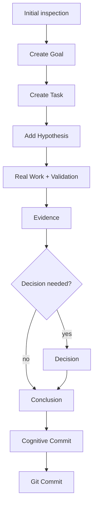

# CTX 目标流转图
如果语言模型及其代理丢失了上下文，这就是你需要的工具。

本文档展示如何在 CTX 中关闭一个 goal，以及每个命令如何在 `.ctx` 中形成认知图谱。

## 示例：用 evidence 关闭一个 viewer gap

目标：`Make a viewer gap visible and close it with evidence`

### 阶段 0：检查当前状态

```powershell
ctx
ctx next
```

如果 helper 输出不足以安全选择，再用：

```powershell
ctx status
ctx audit
```

这一步在 `.ctx` 中的效果：

- 还没有变更
- 只是确认 branch、head 与一致性

### 阶段 1：创建 goal 与 primary task

```powershell
ctx goal add --title "Improve viewer clarity"
ctx task add --title "Add task-state filter to the graph" --goal <goalId>
```

### 阶段 2：用 hypothesis 说明为什么值得做

```powershell
ctx hypo add --statement "Filtering tasks by state reduces graph noise" --task <taskId>
```

### 阶段 3：执行真实工作

```powershell
dotnet build Ctx.Viewer/Ctx.Viewer.csproj
dotnet test .\Ctx.Tests\Ctx.Tests.csproj -m:1
```

### 阶段 4：记录 evidence

```powershell
ctx evidence add --title "Graph exposes task-state filter" --summary "The graph can now hide Done work and isolate active work." --source "Ctx.Viewer/wwwroot/app.js" --kind Experiment --supports hypothesis:<hypothesisId>
```

### 阶段 5：方向确定后记录 decision

```powershell
ctx decision add --title "Use task-state filters as the main graph control" --rationale "It keeps active work readable without hiding full history." --state Accepted --hypotheses <hypothesisId> --evidence <evidenceId>
```

### 阶段 6：用 conclusion 收尾

```powershell
ctx conclusion add --summary "The viewer now filters tasks by state and reduces graph noise." --state Accepted --evidence <evidenceId> --decisions <decisionId> --tasks <taskId>
```

### 阶段 7：认知提交与 Git 提交

```powershell
ctx commit -m "Add task-state filter to viewer graph"
git add ...
git commit -m "Add task-state filter to viewer graph"
git push origin main
```

## 流程图


```mermaid
flowchart TD
    A[Initial inspection] --> B[Create Goal]
    B --> C[Create Task]
    C --> D[Add Hypothesis]
    D --> E[Real Work + Validation]
    E --> F[Evidence]
    F --> G{Decision needed?}
    G -- yes --> H[Decision]
    G -- no --> I[Conclusion]
    H --> I[Conclusion]
    I --> J[Cognitive Commit]
    J --> K[Git Commit]
```

## 最终认知路径

```text
Goal -> Task -> Hypothesis -> Evidence -> Decision -> Conclusion -> Commit
```

如果没有显式 decision，也可以从 `Evidence` 直接进入 `Conclusion`。

## 操作说明

- 除非没有其他可行路径，否则不要手动编辑 `.ctx`
- 如果怀疑存在认知债务，使用 `ctx audit`
- 即使看起来很小，也要把运行中的失败记录为 `evidence`
