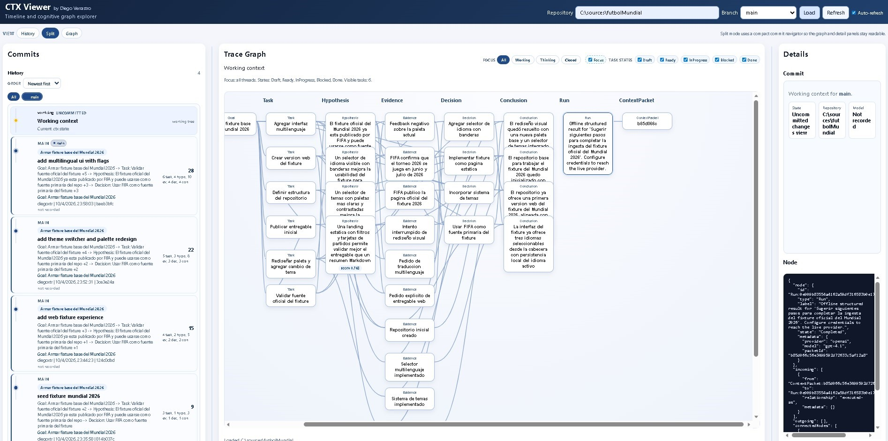
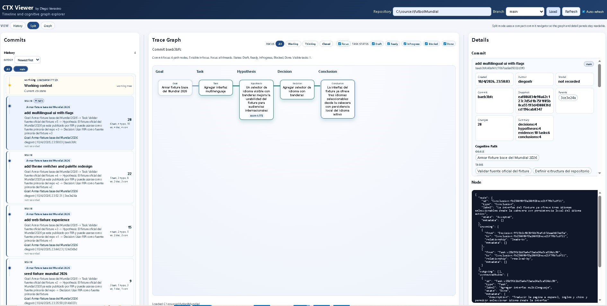

# futbol-mundial

Sanitized public CTX example based on a small project that tracks planning and closure for a football world cup fixture site.

What this example includes:

- a stable `.ctx` history with branches, commits, graph state, and project metadata
- completed tasks, hypotheses, evidence, decisions, and conclusions
- enough lineage to inspect the repository in CTX Viewer or with the CLI
- a documented fixture output snapshot in `fixture-2026-summary.md`
- two sanitized screenshots of the example graph state and node detail
- the static web output that the example produced: `index.html`, `styles.css`, `script.js`, and `data/fixture-2026-summary.md`

## Viewer snapshots

Overview of the example graph state:



Node detail and reasoning path example:



What was removed from the original working repository:

- `working/` and `staging/` transient state
- `runs/`, `metrics/`, `providers/`, `logs/`, and `packets/`
- `write.lock`
- operator-specific trace values and chat-derived source labels

Suggested usage:

```powershell
dotnet run --project .\Ctx.Viewer
```

Then load:

```text
examples\ctx\futbol-mundial
```

To inspect the web output directly, open `examples/ctx/futbol-mundial/index.html`.
